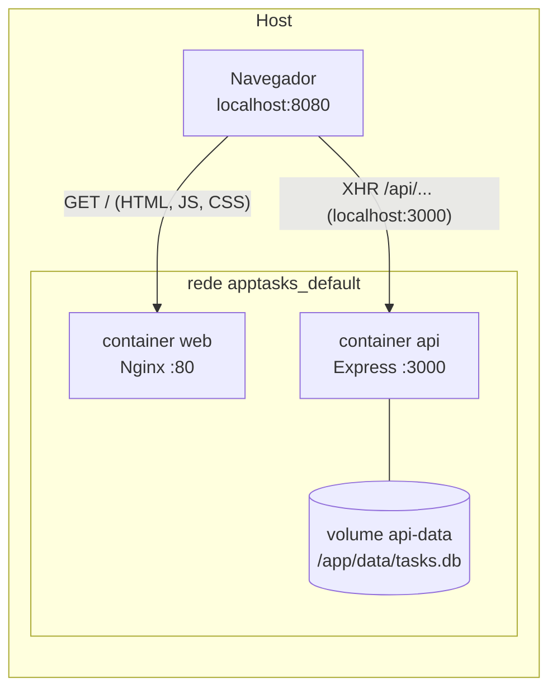

# apptasks

Aplicação de gerenciamento de tarefas com autenticação, dividida em dois serviços
containerizados e orquestrados via Docker Compose:

| Pasta        | Serviço | O que é                                             |
|--------------|---------|-----------------------------------------------------|
| `vue-tasks/` | `web`   | SPA em Vue 3 servida por Nginx                      |
| `api-tasks/` | `api`   | API REST em Express + SQLite com autenticação JWT   |

---

## Tecnologias do front-end (`vue-tasks/`)

| Camada            | Tecnologia                     | Papel no projeto                                                        |
|-------------------|--------------------------------|-----------------------------------------------------------------------|
| Framework UI      | **Vue 3** (`<script setup>` SFC) | Componentes reativos das telas de login, cadastro e tarefas          |
| Linguagem         | **TypeScript**                 | Tipagem em toda a `src/` (stores, services, composables)             |
| Build / dev server| **Vite**                       | Dev server com HMR e bundle de produção                              |
| Estilo            | **Tailwind CSS v4** (`@tailwindcss/vite`) | Utilitários de CSS aplicados direto nos templates         |
| Estado global     | **Pinia**                      | `authStore` (sessão/token) e `tasksStore` (lista de tarefas)         |
| Rotas             | **Vue Router**                 | Navegação SPA + guard de rota autenticada                            |
| HTTP              | **Axios**                      | Instância única em `src/services/api.ts` com interceptors            |
| Feedback visual   | **SweetAlert2**                | Modais de confirmação e erro                                         |
| Ícones            | **lucide-vue-next**            | Ícones dos componentes                                               |
| Type-check        | **vue-tsc**                    | Checagem de tipos dos `.vue` (usado só localmente — ver *Notas*)     |

### Como o front está organizado

```
src/
├── main.ts                 # bootstrap: cria app, Pinia e Router
├── router/index.ts         # rotas + guard de autenticação
├── views/                  # LoginView, RegisterView, TasksView
├── components/             # NavBar, MenuItem, tasks/(TaskForm|TaskItem|TaskList)
├── store/                  # authStore.ts, tasksStore.ts  (Pinia)
├── services/
│   ├── api.ts              # axios.create({ baseURL }) + interceptors
│   ├── authService.ts      # login / register
│   └── tasksService.ts     # CRUD de tarefas
├── composables/useTheme.ts # alternância de tema claro/escuro
└── utils/storage.ts        # wrapper de localStorage (token/usuário)
```

O `src/services/api.ts` centraliza a comunicação com a API:

- `baseURL` vem de `import.meta.env.VITE_API_URL` (com fallback para
  `http://localhost:3000/api`);
- um **interceptor de request** injeta `Authorization: Bearer <token>` quando há
  token salvo;
- um **interceptor de response** trata `401`, limpa a sessão e propaga um erro de
  autenticação.

---

## Como foi montada a containerização

O ponto central é **onde cada chamada acontece**: o navegador do usuário roda o
JavaScript do front e chama a API *diretamente* na porta publicada no host — não é
o container `web` que fala com o `api`. Por isso a URL da API precisa ser conhecida
**em tempo de build** do front.



### 1. `vue-tasks/Dockerfile` — multi-stage (Node → Nginx)

**Stage `build` (`node:22-bookworm-slim`)**

1. `npm ci` com o `package-lock.json` (instala inclusive as devDeps, necessárias
   para o Vite);
2. recebe `ARG VITE_API_URL` (default `http://localhost:3000/api`) e o expõe como
   `ENV` — o Vite embute esse valor no bundle;
3. `npx vite build` gera os estáticos em `/app/dist`.

**Stage `serve` (`nginx:1.27-alpine`)**

4. copia `nginx.conf` para `/etc/nginx/conf.d/default.conf`;
5. copia só o `/app/dist` do stage anterior para `/usr/share/nginx/html`
   (imagem final ~75 MB, sem Node nem `node_modules`);
6. `HEALTHCHECK` faz `wget` em `http://127.0.0.1/` (IPv4 — o Nginx só escuta
   IPv4).

O `nginx.conf` faz:

- **fallback de SPA**: `try_files $uri $uri/ /index.html` para o Vue Router
  funcionar em history mode;
- **cache longo** para `/assets/*` (arquivos com hash no nome);
- **gzip** para HTML/CSS/JS/SVG/JSON.

### 2. `api-tasks/Dockerfile` — multi-stage (deps → runtime)

`sqlite3` e `bcrypt` são módulos nativos e precisam de toolchain para compilar.

**Stage `deps` (`node:22-bookworm-slim`)**

1. instala `python3 make g++` (para o `node-gyp`);
2. `npm ci --omit=dev` compila os binários nativos.

**Stage `runtime` (`node:22-bookworm-slim`)**

3. copia `node_modules` já compilado + o código da aplicação;
4. cria `/app/data`, dá `chown` para o usuário `node` e roda como **não-root**
   (`USER node`);
5. `ENV DB_PATH=/app/data/tasks.db` — o `database.js` lê essa variável
   (`process.env.DB_PATH || path.join(__dirname, 'tasks.db')`), então o SQLite
   grava dentro do volume;
6. `HEALTHCHECK` faz `fetch('http://localhost:3000/')`.

Cada projeto tem um `.dockerignore` que evita copiar `node_modules`, `.env`,
`*.db` e `.git` para o contexto de build.

### 3. `docker-compose.yml` — orquestração

```yaml
services:
  api:
    build: ./api-tasks
    environment:
      PORT: 3000
      DB_PATH: /app/data/tasks.db
      JWT_SECRET: ${JWT_SECRET:-your-secret-key-change-in-production}
    volumes:
      - api-data:/app/data          # persiste o tasks.db
    ports:
      - "${API_PORT:-3000}:3000"

  web:
    build:
      context: ./vue-tasks
      args:
        VITE_API_URL: ${VITE_API_URL:-http://localhost:3000/api}
    ports:
      - "${WEB_PORT:-8080}:80"
    depends_on:
      - api

volumes:
  api-data:
```

- **`depends_on`**: o `web` só sobe depois do `api`.
- **Volume nomeado `api-data`**: o banco sobrevive a `docker compose down` /
  rebuild da imagem (só some com `down -v`).
- **Portas parametrizadas**: `WEB_PORT` / `API_PORT` vêm do `.env`, úteis quando a
  8080/3000 já estão ocupadas no host.
- **`VITE_API_URL` como build arg**: mudou a URL da API? É preciso
  `docker compose build web` de novo, porque o valor está *dentro* do bundle.
- **`JWT_SECRET`** é injetado só em runtime no container `api`.

---

## Como rodar

Pré-requisito: **Docker Desktop** em execução.

```bash
# opcional: ajustar portas / segredo
cp .env.example .env

docker compose up --build -d
```

| Serviço | URL                     |
|---------|-------------------------|
| Front   | http://localhost:8080   |
| API     | http://localhost:3000   |

Usuário de teste (criado automaticamente no primeiro start da API):
`admin` / `admin123`.

Se a porta 8080 ou 3000 estiver ocupada, defina outra no `.env`
(`WEB_PORT` / `API_PORT`) e suba de novo.

### Parar

```bash
docker compose down        # mantém o banco (volume api-data)
docker compose down -v     # remove também o banco
```

---

## Notas

- O build do front no Docker usa `npx vite build` em vez do script
  `npm run build`. O script roda `vue-tsc -b` antes, e o type-check hoje falha por
  questões pré-existentes do projeto (sem shims para `*.vue`, alias `@` ausente no
  `tsconfig.app.json`, `noImplicitAny` em `src/utils/storage.ts`). Isso não afeta
  o bundle gerado pelo Vite.
- Detalhes dos endpoints da API estão em [`api-tasks/README.md`](api-tasks/README.md).
